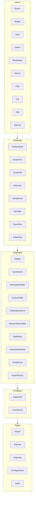

# Design System — Caixa da Pelada

Identidade: **placar de futebol / campo**. Sóbrio, legível, com números em destaque (como um
placar). O protótipo `reference/pelada-caixa.html` é a **referência visual viva** — abra-o
para ver os componentes em uso. Este documento é a especificação para reconstruir no
`apps/web` (React + Tailwind, Atomic Design).

## 1. Tokens

### Cores

| Token | Hex | Uso |
|---|---|---|
| `pitch` | `#0e6b46` | cor primária (grama); ações, positivo |
| `pitch-deep` | `#0a4f34` | hover do primário; fundo do placar |
| `pitch-dark` | `#082c1f` | fundo escuro do placar (gradiente) |
| `chalk` | `#f3f6f2` | linha de cal / detalhes claros |
| `paper` | `#eef1ec` | fundo da página |
| `card` | `#ffffff` | superfície de cards/tabelas |
| `ink` | `#13201a` | texto principal |
| `muted` | `#5f6f66` | texto secundário |
| `line` | `#dde4dd` | bordas e divisores |
| `clay` | `#c0492f` | alerta / inadimplente |
| `clay-soft` | `#fbeae5` | fundo de alerta |
| `gold` | `#b8860b` | caixa / saldo |
| `gold-soft` | `#f7efd6` | fundo dourado suave |
| `blue` | `#256364` | acento para avulsos |

Semântica: positivo/entrou = `pitch`; negativo/saiu = `clay`; saldo/caixa = `gold`;
em aberto/inadimplente = `clay`; avulso = `blue`.

### Tipografia

- **Display** (títulos, números do placar): `Oswald` (600). Condensada, "esportiva".
- **Texto/UI**: `Inter` (400/500/600/700).
- Números monetários sempre com `tabular-nums` (alinhamento de colunas).

Escala sugerida (rem): h1 1.6 / h2 1.4 / placar 2.1 / stat 1.6 / corpo 1.0 / small 0.875 /
tiny 0.75. Pesos: títulos 600, rótulos 600–700, corpo 400–500.

### Espaçamento, raio, sombra

- Espaçamento base 4px (escala do Tailwind). Padding de card 18–20px.
- Raio: `card` = 14px; controles 9–10px; chips/badges 999px.
- Sombra de card: `0 1px 2px rgba(8,44,31,.06), 0 8px 24px rgba(8,44,31,.06)`.
- Foco: `outline: 2px solid rgba(14,107,70,.35)` (anel verde).

## 2. Tailwind (`tailwind.config.ts`)

```ts
import type { Config } from "tailwindcss";
export default {
  content: ["./src/**/*.{ts,tsx}"],
  theme: {
    extend: {
      colors: {
        pitch: { DEFAULT: "#0e6b46", deep: "#0a4f34", dark: "#082c1f" },
        chalk: "#f3f6f2", paper: "#eef1ec", card: "#ffffff",
        ink: "#13201a", muted: "#5f6f66", line: "#dde4dd",
        clay: { DEFAULT: "#c0492f", soft: "#fbeae5" },
        gold: { DEFAULT: "#b8860b", soft: "#f7efd6" },
        blue: "#256364",
      },
      fontFamily: {
        display: ["Oswald", "sans-serif"],
        sans: ["Inter", "system-ui", "sans-serif"],
      },
      borderRadius: { card: "14px" },
      boxShadow: { card: "0 1px 2px rgba(8,44,31,.06), 0 8px 24px rgba(8,44,31,.06)" },
    },
  },
} satisfies Config;
```

Carregar as fontes via `next/font` (Oswald + Inter). Use classes utilitárias; para padrões
repetidos (badge, botão), criar componentes React (não `@apply` espalhado).

## 3. Hierarquia de componentes (Atomic Design)



Regra: **átomos não conhecem domínio** (só props visuais). Domínio entra a partir de
organisms. Reutilize `formatBRL`, `suggestSplit` etc. de `@pelada/core`.

## 4. Componentes — especificação

### Button (atom)
- Variantes: `primary` (fundo `pitch`, texto branco), `gold`, `danger` (texto `clay`, borda
  suave), `ghost` (sem borda), default (branco com borda `line`).
- Tamanhos: `sm`, `md`. Estados: hover (escurece/realça), `disabled` (opacidade .5), `loading`
  (spinner + desabilita).

### Badge (atom)
Variantes mapeadas a domínio: `mensal` (verde), `avulso` (azul), `quadra` (dourado),
`saida` (terroso), `outro` (cinza), `novo` (âmbar), `ok` (verde, "Pago"), `due` (clay, "Em
aberto"). Formato pílula, 11–12px, uppercase leve.

### Input / Select / MonthInput (atoms)
Borda `line`, raio 9px; foco com anel verde; estado de erro com borda `clay` + mensagem.

### Money (atom)
Recebe a **string já formatada** vinda da API (ex.: "R$ 70,00") e a exibe com `tabular-nums`.
Prop `tone` (pos/neg/gold) só controla a cor. O front não formata nem faz contas de dinheiro.

### ScoreCell + Scoreboard (molecule/organism) — assinatura
Placar com fundo verde-escuro radial e divisórias claras. Três células: **Entrou** (verde),
**Saiu** (vermelho-claro), **Saldo** (dourado/vermelho). Números grandes em Oswald.

### AlertBanner (molecule)
Dois tons: `warn` (fundo `clay-soft`, borda/ícone clay — quadra não paga, sem WhatsApp) e
`ok` (verde — quadra paga). Ícone + texto.

### ReconciliationTable + SplitModal (organisms) — núcleo
Tabela editável: incluir (checkbox), data, nome no extrato (+ badge "novo"), valor, categoria
(select), pagante (select/criar), competência (month), ação **Dividir**. O `SplitModal`
edita cotas (valor + categoria + pagante por linha), valida soma == total, marca a 1ª cota
como pagador.

### PayerEditorModal (organism)
Nome, tipo, status, "mensalista desde", **WhatsApp** (com aviso quando falta), apelidos
reconhecidos (chips).

## 5. Estados e acessibilidade

- Linha de tabela: hover suave; lançamento ignorado/desmarcado em opacidade reduzida.
- Contraste: texto `ink` sobre `paper`/`card` ok; alertas usam `clay` sobre `clay-soft`.
- Foco sempre visível (anel verde) — não remover outline.
- Mobile-first (o protótipo nasce no celular): alvos de toque ≥ 40px; tabelas com scroll
  horizontal em telas estreitas.
- Não comunicar status só por cor: "Pago"/"Em aberto" têm texto além do `dot` colorido.

## 6. Conteúdo / tom de voz

Português coloquial e direto ("Entrou", "Saiu", "Em aberto", "Cobrar no WhatsApp"). Mensagem
de cobrança amistosa, com nome, mês e valor (ver DOMAIN.md §12).
