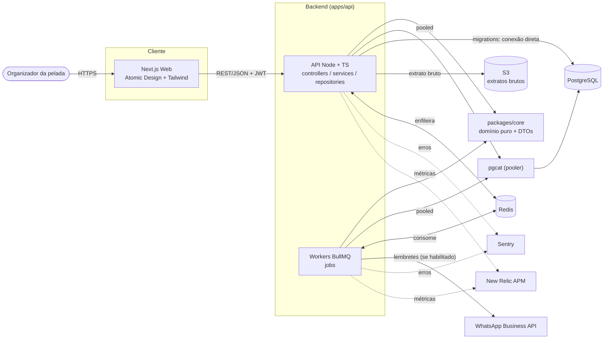
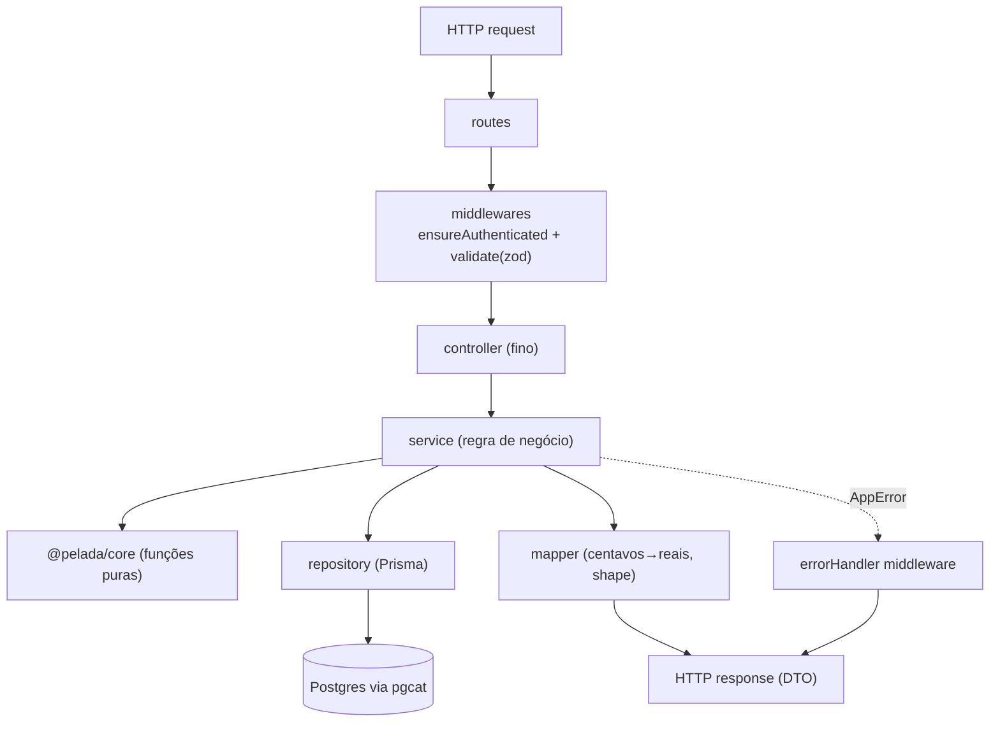
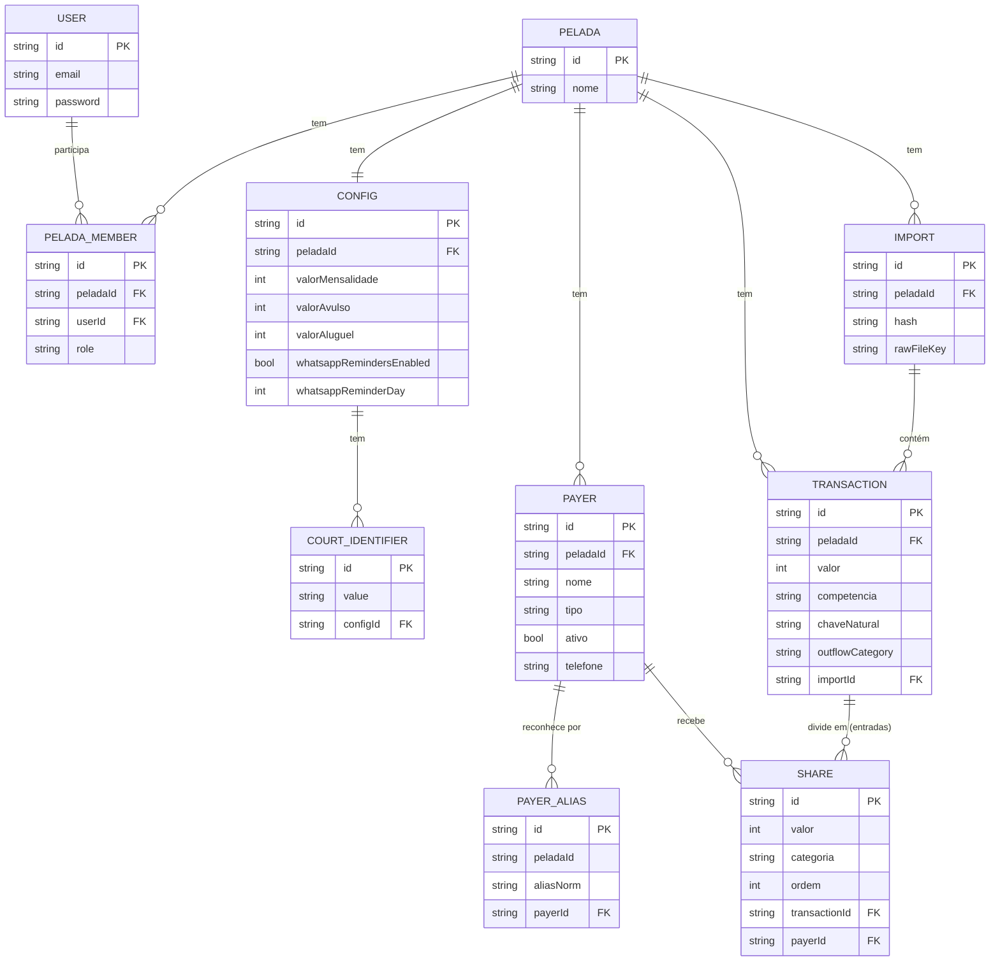
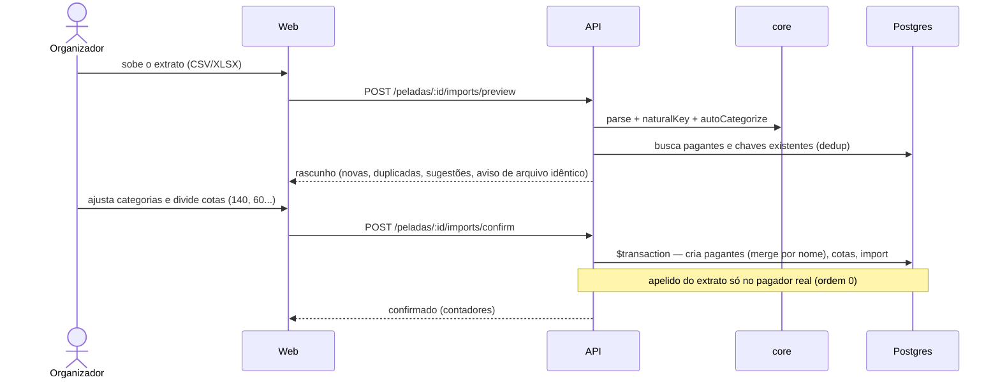
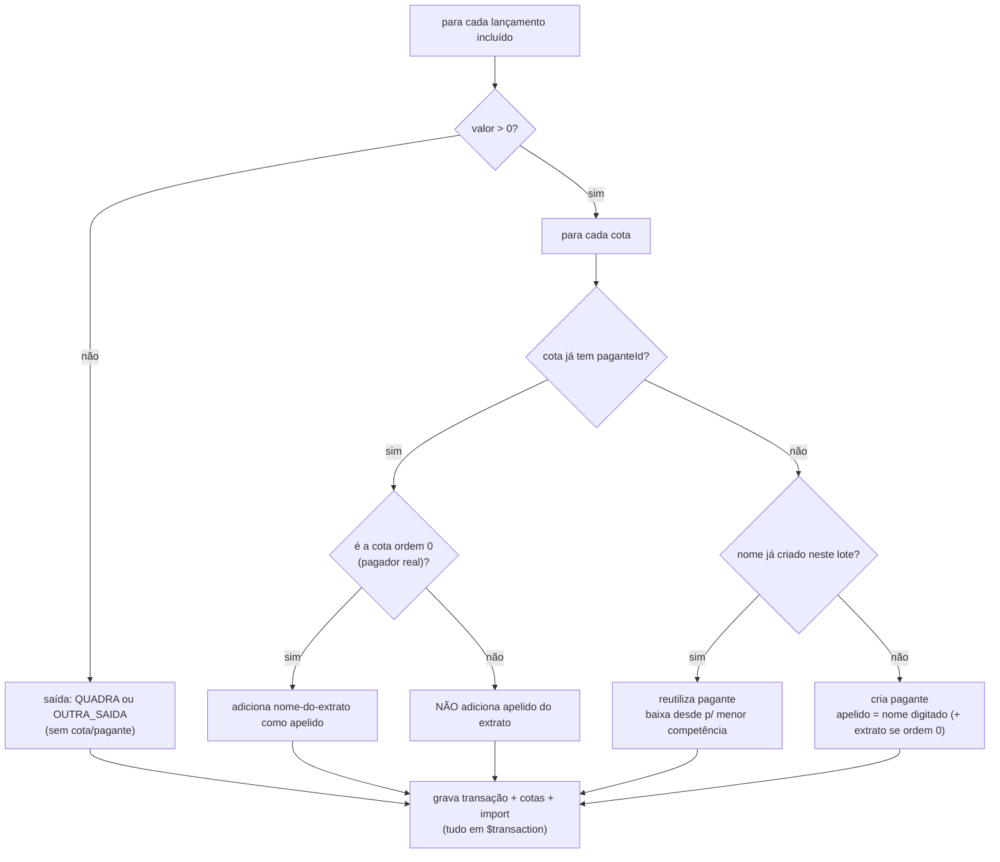
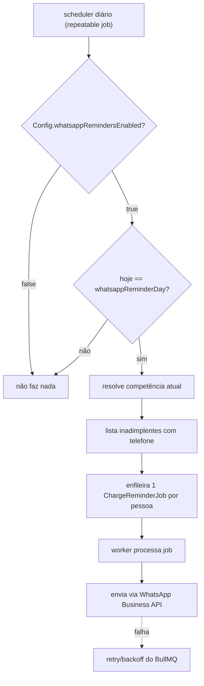

# System Design — Caixa da Pelada

Diagramas em Mermaid (renderizam no GitHub, no VS Code com extensão Mermaid e em
muitos viewers de Markdown).

## 1. Visão de containers (alto nível)

## 2. Camadas do backend (fluxo de uma requisição)

## 3. Modelo de dados (ER)

## 4. Importação e conciliação (sequência)

## 5. Algoritmo de confirmação (regras críticas)

## 6. Lembrete de WhatsApp (parametrizado, default desligado)

## 7. Notas

- **Observabilidade** (não-opcional): Sentry captura exceções na API e nos workers; New Relic
  faz APM (latência de rota, throughput, erros, jobs). Front pode usar New Relic Browser.
- **Filas** (não-opcional): BullMQ sobre Redis. Além do lembrete de WhatsApp, a fila pode
  absorver tarefas pós-import (ex.: notificações) sem travar a request.
- **pgcat**: pooler escolhido por lidar melhor com a transação interativa do
  `ConfirmReconciliationService`. Migrations sempre pela conexão direta.
